# 一、Spring AI 简介

在当今这样一个快速发展的技术时代，人工智能（AI）已经成为各行各业的一种标配。而 Spring 作为一款主流的 Java 应用开发框架，肯定会紧跟时代的潮流，所以，推出了 Spring AI 框架。

## 1、Spring AI 是什么

### 1.1、官网描述

官网地址：<https://spring.io/projects/spring-ai>

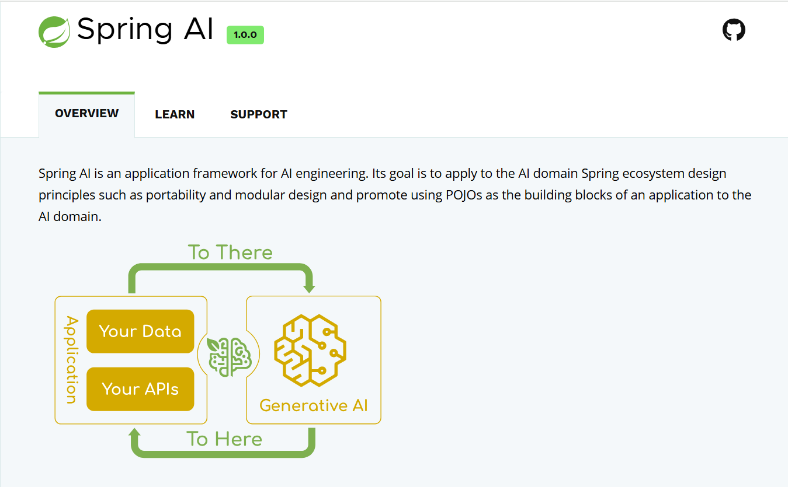

Spring AI 是一个 AI 工程领域的应用程序框架。

Spring AI 是 AI 工程的应用框架。其目标是将 Spring 生态系统设计原则（如可移植性和模块化设计）应用于 AI 领域，并促进使用 POJO 作为应用程序的构建块到 AI 领域。

Spring AI 的核心是提供了开发 AI 大模型应用所需的基本抽象模型，这些抽象拥有多种实现方式，使得开发者可以用很少的代码改动就能实现组件的轻松替换。

简言之，Spring AI 是一个 AI 工程师的应用框架，它提供了一个友好的 API 和开发 AI 应用的抽象，旨在简化 AI 大模型应用的开发工作。

### 1.2、发布版本

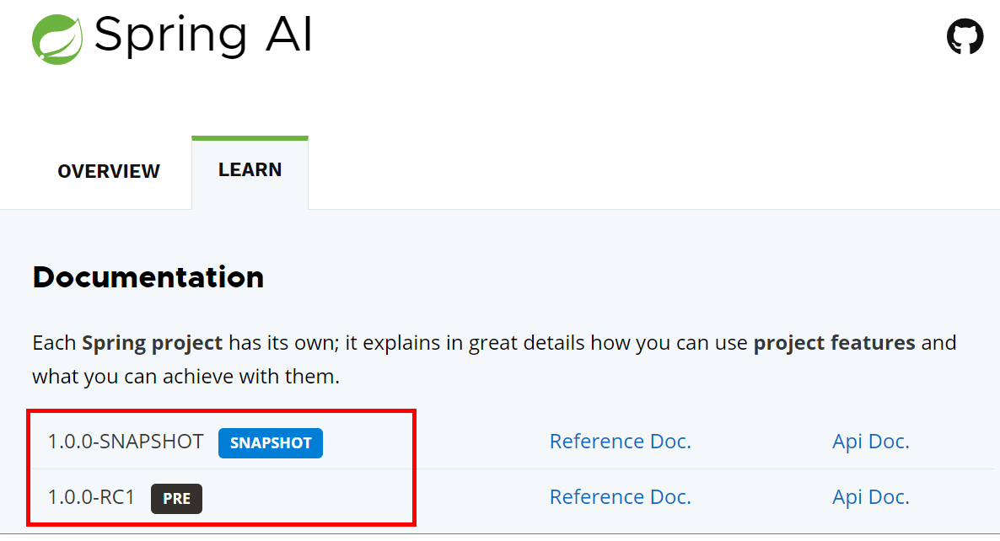

目前 Spring AI 推出了一个预览版（PRE）和一个快照版（SNAPSHOT），GA 版尚未发布，大家可以提前学习，等 GA 版发布后再真正用在项目中。

* SNAPSHOT 指的是快照版，会在此版本上持续更新
* PRE 指的是预览版，主要提供给开发测试人员找 bug，不断修改完善的
* GA 指的是 General Availability，意为正式发布的版本，推荐使用（主要是稳定）

## 2、Spring AI 的主要功能

* 第一、对主流 AI 大模型供应商提供了支持，比如：OpenAI、DeepSeek、Microsoft、Ollama、Amazon、Google HuggingFace 等。
* 第二、支持 AI 大模型类型包括：聊天、文本到图像、文本到声音等。
* 第三、支持主流的 Embedding Models（嵌入模型）和向量数据库，比如：Azure Vector Search、Chroma、Milvus、Neo4j、Redis、PineCone、PostgreSQL/PGVector 等。
* 第四、把 AI 大模型输出映射到简单的 Java 对象（POJOs）上。
* 第五、支持了函数调用（Function calling）功能。
* 第六、为数据工程提供 ETL（数据抽取、转换和加载）框架。
* 第七、支持 Spring Boot 自动配置和快速启动，便于运行 AI 模型和管理向量库。

# 二、Spring AI 快速入门

## 1、准备工作

### 1.1、什么是 DeepSeek

DeepSeek 是一款由深度求索所开发的 AI 人工智能大模型，其基于深度学习和多模态数据融合技术，采用先进的 Transformer 架构和跨模态协同算法，可实现对复杂文档和图像的自动化解析与结构化信息提取。

依托于最新推出的“深度思考”模式（R1），这款 AI 大模型在极低成本下实现了与国际顶尖模型 ChatGPT-o1 相媲美的性能表现，其中文理解与输出能力更是远超 ChatGPT、Claude 等顶尖模型。再加上极具竞争力的 API 定价和全面开源的策略，让这款 AI 大模型成功在国际上火爆出圈。

如果说 AI 是一个广泛的概念，那么 DeepSeek 就是 AI 领域中的一个具体产品。

**DeepSeek 的特点**：

- **成本**：DeepSeek 致力于降低 AI 应用的成本。通过采用先进的技术和独特的模型架构，DeepSeek 在保持高性能的同时，显著降低了推理和训练的成本。
- **性能**：DeepSeek 在性能上表现出色。它使用强化学习技术训练，推理过程中包含大量反思与验证，能够处理更加复杂的数据和任务。在一些 benchmark 测试中，其性能与 OpenAI 的模型相当，但推理成本远低于同类产品。
- **功能**：DeepSeek 擅长处理数学、编程和复杂逻辑推理等任务。它的推理能力源于深度思考特性，推理长度与准确率呈正相关。此外，DeepSeek 还支持多模态信息处理，能够应对更加多样化的应用场景。
- **应用领域**：DeepSeek 在多个领域展现出巨大的应用潜力。无论是在医疗、教育、交通等传统领域，还是在智能制造、智慧城市等新兴领域，DeepSeek 都有望发挥重要作用。

综上所述，AI 是一个广泛的概念，涵盖了人工智能领域的所有技术和应用。而 DeepSeek 则是 AI 领域中的一个具体产品，它在成本、性能、功能和应用领域等方面都有着独特的特点和优势。两者之间的关系可以理解为：DeepSeek 是 AI 领域中的一个具体实现和优秀代表。

**如何使用 Java 集成 DeepSeek**：

DeepSeek 作为一款卓越的国产 AI 模型，越来越多的公司考虑在自己的应用中集成。对于 Java 应用来说，我们可以借助 Spring AI 集成 DeepSeek，非常简单方便。

### 1.2、DeepSeek 开放平台创建 API KEY

1、进入 DeepSeek 官网 <https://www.deepseek.com/>  点击右上角的 **API 开放平台**

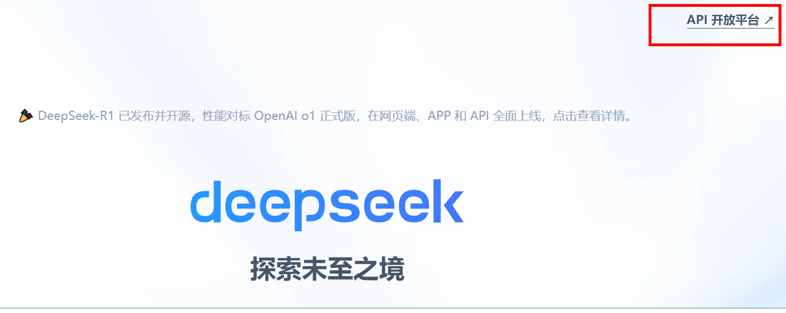

2、进入 API 开放平台，注册用户

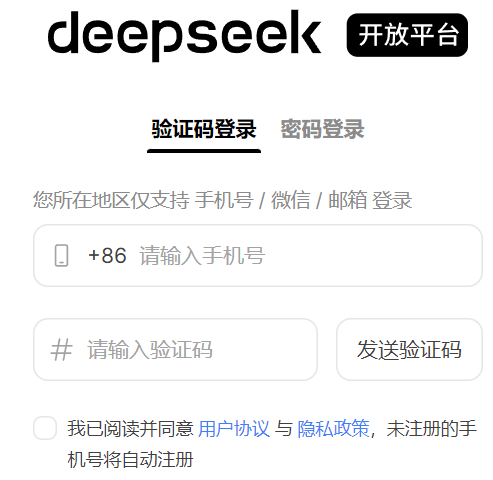

3、创建 API key

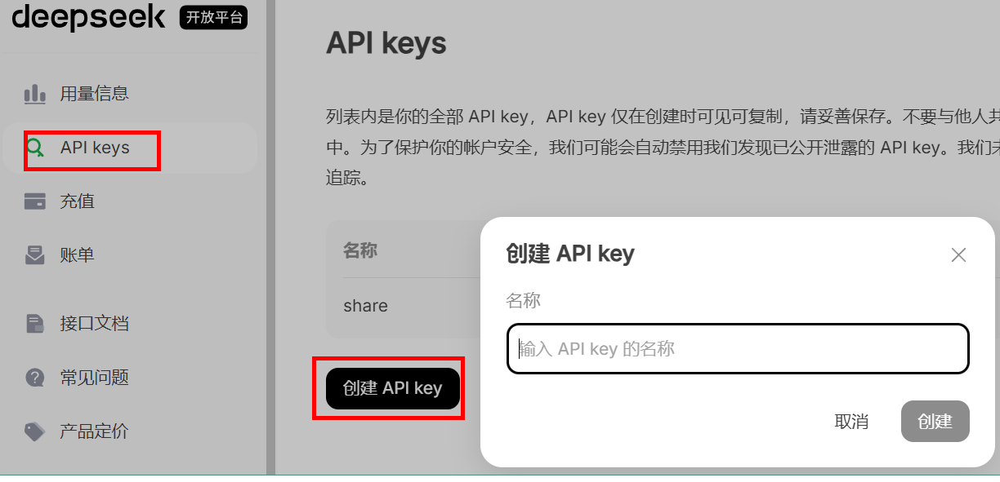

4、根据自己需要，自行充值

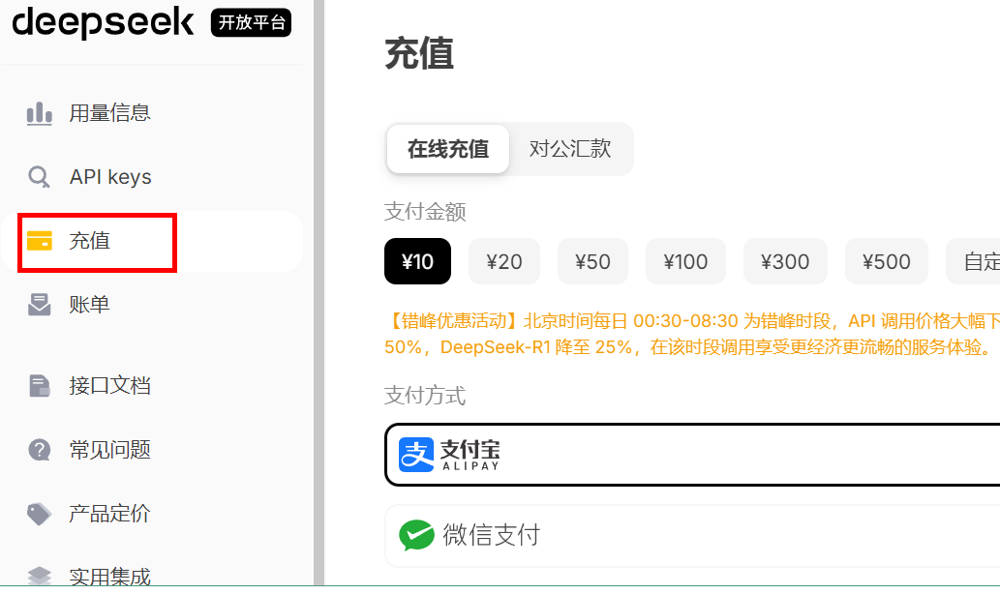

5、Spring AI 的 spring-ai-openai-spring-boot-starter 本质上是通过 RestTemplate 发请求

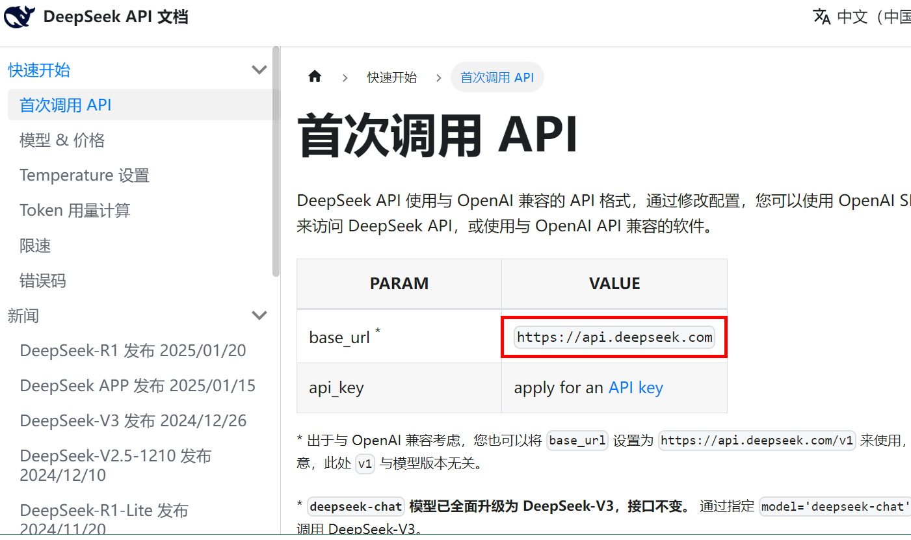

## 2、创建SpringBoot工程

### 2.1、引入依赖

> SpringAI 对于 SpringBoot 和 JDK 的版本要求：
>
> 

```xml
<?xml version="1.0" encoding="UTF-8"?>
<project xmlns="http://maven.apache.org/POM/4.0.0"
         xmlns:xsi="http://www.w3.org/2001/XMLSchema-instance"
         xsi:schemaLocation="http://maven.apache.org/POM/4.0.0 http://maven.apache.org/xsd/maven-4.0.0.xsd">
    <modelVersion>4.0.0</modelVersion>

    <parent>
        <groupId>org.springframework.boot</groupId>
        <artifactId>spring-boot-starter-parent</artifactId>
        <version>3.3.13</version>
        <relativePath/> <!-- lookup parent from repository -->
    </parent>

    <groupId>com.atguigu</groupId>
    <artifactId>springai-01-hello</artifactId>
    <version>1.0-SNAPSHOT</version>

    <properties>
        <maven.compiler.source>17</maven.compiler.source>
        <maven.compiler.target>17</maven.compiler.target>
        <project.build.sourceEncoding>UTF-8</project.build.sourceEncoding>
        <spring-ai.version>1.1.2</spring-ai.version>
    </properties>

    <dependencies>
        <dependency>
            <groupId>org.springframework.boot</groupId>
            <artifactId>spring-boot-starter-web</artifactId>
        </dependency>

        <!--<dependency>
            <groupId>org.springframework.ai</groupId>
            <artifactId>spring-ai-openai-spring-boot-starter</artifactId>
            <version>1.0.0-M6</version>
        </dependency>-->

        <dependency>
            <groupId>org.springframework.ai</groupId>
            <artifactId>spring-ai-starter-model-openai</artifactId>
        </dependency>
    </dependencies>

    <dependencyManagement>
        <dependencies>
            <dependency>
                <groupId>org.springframework.ai</groupId>
                <artifactId>spring-ai-bom</artifactId>
                <version>${spring-ai.version}</version>
                <type>pom</type>
                <scope>import</scope>
            </dependency>
        </dependencies>
    </dependencyManagement>
</project>
```

### 2.2、创建配置文件

创建 application.properties，配置内容如下：

```properties
server.port=8899
spring.application.name=spring-ai-deepseek-demo

spring.ai.openai.api-key=sk-139298b9e929496290******
spring.ai.openai.base-url=https://api.deepseek.com
spring.ai.openai.chat.options.model=deepseek-chat
spring.ai.openai.chat.options.temperature=0.7
```

* temperature 参数用于控制生成文本的多样性。具体来说：
  * 值越高，生成的文本越多样化，但也可能包含更多的随机性和不可预测的内容。
  * 值越低，生成的文本越接近于确定性的结果，即生成的文本会更加一致和可预测。
  

也可创建 applicatio.yml

```yaml
server:
  port: 8899

spring:
  application:
    name: spring-ai-deepseek-demo
  ai:
    openai:
      api-key: ${SPRINGAI_LEARNING_DEEPSEEK_API_KEY}
      base-url: https://api.deepseek.com
      chat:
        options:
          model: deepseek-chat
          temperature: 0.7
```

其中 `SPRINGAI_LEARNING_DEEPSEEK_API_KEY` 为环境变量

### 2.3、创建启动类

```java
@SpringBootApplication
public class SpringAiDemoApplication {
    public static void main(String[] args) {
        SpringApplication.run(SpringAiDemoApplication.class, args);
    }
}
```

### 2.4、创建 Controller

```java
@RestController
public class ChatDeepSeekController {
    @Autowired
    // private ChatModel chatModel; // 也可直接这么写
    private OpenAiChatModel chatModel;

    @GetMapping("/hello")
    public String hello(@RequestParam(value = "message", defaultValue = "hello") String message) {
        String response = chatModel.call(message);
        System.out.println("response : " + response);
        return response;
    }
}
```

### 2.5、测试

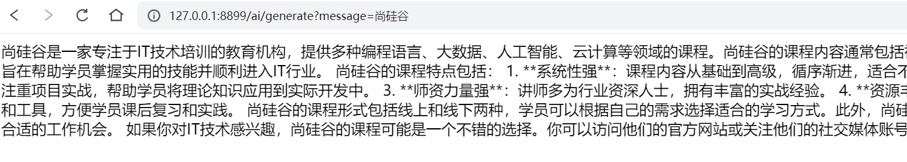

# 三、Spring AI 的聊天模型

## 1、概述

Spring AI 的聊天模型 API 为开发者提供了一条便捷通道，能够将强大的 AI 驱动的聊天完成功能无缝集成到各类应用中。借助预先训练的语言模型，如广为人知的 GPT，它能够依据用户输入生成自然流畅、类人化的回复。这一 API 不仅工作机制高效，而且设计理念极为先进，旨在实现简单易用与高度可移植性，让开发者能以极少的代码改动在不同 AI 模型间自由切换，充分契合 Spring 框架一贯秉持的模块化与可互换性原则。

## 2、ChatClient 接口

ChatClient 是一个接口，它定义了一个与聊天服务交互的客户端。这个接口主要用于创建聊天客户端对象，设置请求规范，以及发起聊天请求。

### 2.1、实现简单的对话

1、需求

用户输入设置用户消息的内容，通过 Spring AI 封装的方法向 AI 模型发送请求，以字符串形式返回 AI 模型的响应。

2、编写 Controller 方法

```java
@RestController
public class ChatController {
    private final ChatClient chatClient;

    public ChatController(ChatClient.Builder chatClientBuilder) {
        this.chatClient = chatClientBuilder.build();
    }

    @GetMapping("/chat")
    public String chat(@RequestParam(value = "msg",defaultValue = "给我讲个笑话") String message) {
        return this.chatClient.prompt() // 提示词
                .user(message) // 用户输入的信息
                .call() // 请求大模型
                .content(); // 返回文本
    }
}
```

3、测试结果

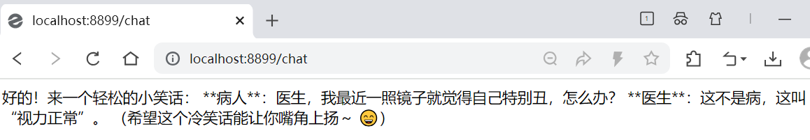

4、总结

ChatClient 接口提供了构建和配置聊天客户端对象的灵活性，以及发起和处理聊天请求的能力。用户可以通过 `ChatClient.Builder` 来定制客户端的行为，然后使用 `prompt()` 和 `prompt(Prompt prompt)` 方法设置请求规范，最后通过 `call()` 方法发起聊天请求。

### 2.2、实现角色预设

1、配置默认角色

```java
@Configuration
public class AIConfig {
    @Bean
    public ChatClient chatClient(ChatClient.Builder builder) {
        return builder.defaultSystem("你是尚硅谷教育的一名老师，你精通Java开发，" + "你的名字叫尚硅谷。").build();
    }
}
```

2、编写 Controller

```java
@RestController
@RequestMapping("/ai")
public class AIController {
    @Autowired
    private ChatClient chatClient;

    @GetMapping("/chat")
    public String chat(@RequestParam(value = "msg") String message) {
        return chatClient.prompt().user(message).call().content();
    }
}
```

3、测试结果

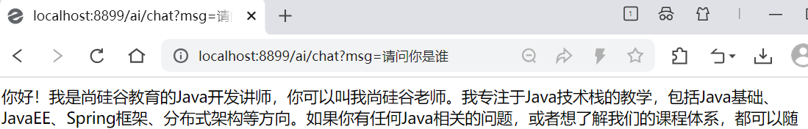

### 2.3、实现流式响应

1、call 和 stream 的区别

* 非流式输出 call：等待大模型把回答结果全部生成后输出给用户

* 流式输出 stream：逐个字符输出，一方面符合大模型生成方式的本质，另一方面当模型推理效率不是很高时，流式输出比起全部生成后再输出大大提高用户体验。

2、编写 Controller

```java
@GetMapping(value = "/chat/stream", produces = "text/html;charset=UTF-8")
public Flux<String> chatStream(@RequestParam(value = "msg") String message) {
    return chatClient.prompt().user(message).stream().content();
}
```

3、测试结果

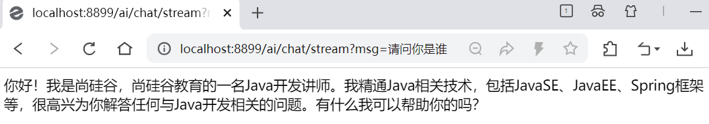

## 3、ChatModel 接口

### 3.1、概述

ChatModel 接口作为核心，定义了与 AI 模型交互的基本方法。它继承自 `Model<Prompt, ChatResponse>`，提供了两个重载的 call 方法：

```java
public interface ChatModel extends Model<Prompt, ChatResponse> {
    default String call(String message) {...}
    
    @Override
    ChatResponse call(Prompt prompt);
}
```

在 ChatModel 接口中，带有 String 参数的 `call()` 方法简化了实际的使用，避免了更复杂的 Prompt 和 ChatResponse 类的复杂性。但是在实际应用程序中，更常见的是使用 `ChatResponse call()` 方法，该方法采用 Prompt 实例并返回 ChatResponse。

我们使用的 ChatClient 底层是使用 ChatModel 作为属性的，在初始化 ChatClient 的时候可以指定 ChatModel，这里我们直接看底层源码：

```java
// ChatClient（部分构造器代码）
static ChatClient create(ChatModel chatModel) {
    return create(chatModel, ObservationRegistry.NOOP);
}
```

### 3.2、实现简单的对话

```java
@RestController
public class DeepSeekController {
    @Autowired
    private ChatModel chatModel;

    @GetMapping
    public String chat(@RequestParam("msg") String msg) {
        return chatModel.call(msg);
    }

    @GetMapping("/openai")
    public String openai(@RequestParam("msg") String msg) {
        ChatResponse chatResponse = chatModel.call(
                new Prompt(
                        msg,
                        OpenAiChatOptions.builder()
                                // 可以更换成其他大模型
                                .model("deepseek-chat")
                                .temperature(0.8)
                                .build()
                )
        );
        return chatResponse.getResult().getOutput().getText();
    }
}
```

### 3.3、提示词

提示词是引导大模型生成特定输出的输入，提示词的设计和措辞会极大地影响模型的响应结果

Prompt 提示词是与模型交互的一种输入数据组织方式，本质上是一种复合结构的输入，在 Prompt 中我们可以包含多组不同角色（System、User、Aissistant 等）的信息。如何管理好 Prompt 是简化 AI 应用开发的关键环节。

Spring AI 提供了 Prompt Template 提示词模板管理抽象，开发者可以预先定义好模板，并在运行时替换模板中的关键词。在 Spring AI 与大模型交互的过程中，处理提示词首先要创建包含动态内容占位符 `{占位符}` 的模板，然后这些占位符会根据用户请求或应用程序中的其他代码进行替换。在提示词模板中，`{占位符}` 可以用 Map 中的变量动态替换。

```java
/**
 * 提示词操作
 * @param name 名字
 * @param voice 习惯
 * @return
 */
@GetMapping("/prompt")
public String prompt(@RequestParam("name") String name, @RequestParam("voice") String voice) {
    // 设置用户输入信息
    String userText= "给我推荐四川的至少三种美食";
    UserMessage userMessage = new UserMessage(userText);
    
    // 设置系统提示信息
    String systemText= """
            你是一个美食咨询助手，可以帮助人们查询美食信息。
            你的名字是{name},
            你应该用你的名字和{voice}的饮食习惯回复用户的请求。
            """;
                
    // 使用Prompt Template设置信息
    SystemPromptTemplate systemPromptTemplate = new SystemPromptTemplate(systemText);
    
    //替换占位符
    Message systemMessage = systemPromptTemplate.createMessage(Map.of("name", name, "voice", voice));
    
    // 使用Prompt封装
    Prompt prompt = new Prompt(List.of(userMessage, systemMessage));
    
    // 调用chatModel方法
    List<Generation> results = chatModel.call(prompt).getResults();
    
    return results.stream().map(x -> x.getOutput().getContent()).collect(Collectors.joining(""));
}
```

# 四、Spring AI 的函数调用

## 1、概述

Spring AI 的函数调用（Function Calling）功能允许大语言模型在生成回答时触发预定义的外部函数，从而实现动态数据获取或业务逻辑操作（如查询数据库、调用 API 等）。

Spring AI 帮我们规范了函数定义、注册等过程，并在发起模型请求之前自动将函数注入到 Prompt 中，而当模型决策在合适的时候去调用某个函数时，Spring AI 完成函数调用动作，最终将函数执行结果与原始问题再一并发送给模型，模型根据新的输入决策下一步动作。这其中涉及与大模型的多次交互过程，一次函数调用就是一次完成的交互过程。

**函数调用的核心流程**：

* 第一步，定义函数：声明可供模型调用的函数（名称、描述、参数结构）。
* 第二步，模型交互：将函数信息与用户输入一起发送给模型，模型决定是否需要调用函数。
* 第三步，执行函数：解析模型的函数调用请求，执行对应的业务逻辑。
* 第四步，返回结果：将函数执行结果返回给模型，生成最终回答。

## 2、函数调用实现

1、创建自定义的 Function

下面 CalculatorService 类自定义了加法和乘法运算的函数

```java
@Configuration
public class CalculatorService {
    public record AddOperation(int a, int b) {

    }

    public record MulOperation(int m, int n) {

    }

    @Bean
    @Description("加法运算")
    public Function<AddOperation, Integer> addOperation() {
        return request -> {
            return request.a + request.b;
        };
    }

    @Bean
    @Description("乘法运算")
    public Function<MulOperation, Integer> mulOperation() {
        return request -> request.m * request.n;
    }
}
```

**总结**：

Spring AI 使自定义函数这个过程变得简单，只需定义一个返回 java.util.Function 的 @Bean 定义，并在调用 ChatModel 时将 Bean 名称作为选项进行注册即可。在底层，Spring 会用适当的适配器代码包装你的函数，以便与 AI 模型进行交互，免去了编写繁琐的代码。

2、编写 Controller

```java
@RestController
public class FunctionController {
    @Autowired
    private ChatModel chatModel;

    @GetMapping(value = "/function", produces = MediaType.APPLICATION_STREAM_JSON_VALUE)
    public String function(@RequestParam("userMessage") String userMessage) {
        return ChatClient.builder(chatModel)
                .build().prompt()
                .system("""
                        你是算术计算器的代理。
                        你能够支持加法运算、乘法运算等操作，其余功能将在后续版本中添加，如果用户问的问题不支持请告知详情。
                        在提供加法运算、乘法运算等操作之前，你必须从用户处获取如下信息：两个数字，运算类型。
                        请调用自定义函数执行加法运算、乘法运算。
                        请讲中文。
                        """)
                .user(userMessage)
                .toolNames("addOperation", "mulOperation")
                .call()
                .content();
    }
}
```

为了让模型知道并调用你的自定义函数，你需要在 Prompt 请求中启用它，如上述代码，在 `toolNames("addOperation", "mulOperation")` 中告知 ChatClient 要使用这两个自定义函数。

另外指定了 System Prompt：要求 AI 模型被设定为一个算术计算器代理，能够执行加法和乘法运算，并且要求用户提供两个数字和运算类型。这个提示词内容很关键，如何让 AI 按照自己的意图去执行，要不断测试提示词内容。

3、测试

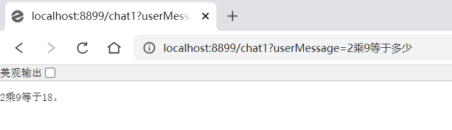

# 五、Spring AI 调用 Ollama

## 1、下载并安装 Ollama

官网：<https://ollama.com/>

### 1.1、下载 Ollama

Ollama 是一个用于本地化部署和管理大型语言模型（LLM）的工具。它支持多种开源模型（如 LLaMA、Alpaca 等），并提供了简单的 API 接口，方便开发者调用。Ollama 可以让你在自己的电脑上运行各种强大的 AI 模型，就像运行普通软件一样简单。

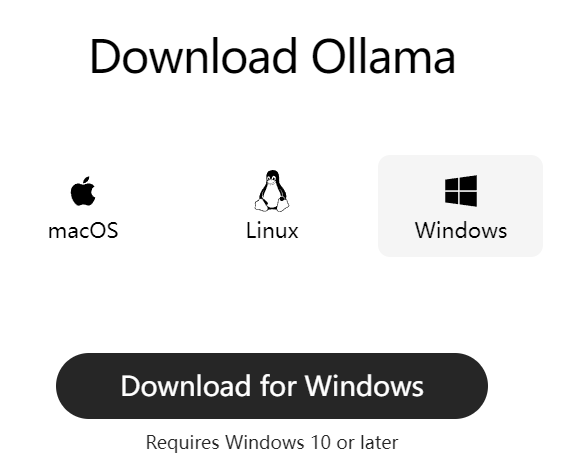

### 1.2、安装 Ollama

模型默认安装在 C 盘，可以修改安装路径

安装 Ollama 到其他盘的方法：

在终端中进入 Ollama 安装程序存放的目录下，然后输入安装指令：`OllamaSetup.exe /DIR=应用程序指定安装的目录`

示例：

```bash
OllamaSetup.exe /DIR=D:\Ollam
```

点击环境变量，选择下面新建一个系统环境变量 OLLAMA_MODELS，然后指定想要安装模型的路径，比如  “D:\Deepseek”

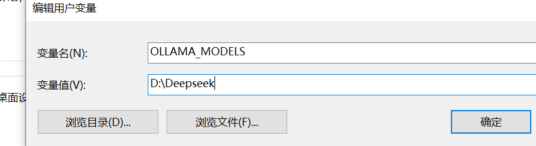

需要重启 Ollama 生效

### 1.3、拉取 DeepSeek 模型

硬件配置建议：

* GPU 选择（根据模型大小灵活调整）：
  * 入门配置：NVIDIA 显卡（≥ 8 GB 显存）→ 适合 7 B / 8 B 模型。

  * 高性能配置：NVIDIA 显卡（≥ 16 GB 显存）→ 支持 14 B 大模型。

  * 无独立显卡用户：可使用 CPU 模式运行（速度约为 GPU 的 20%）。

* 内存要求：≥ 16 GB（推荐 32 GB，处理长文本时不易卡顿）
* 存储空间：≥ 50 GB 可用空间（建议 SSD 硬盘，加快模型加载速度）

* 操作系统：
  * Windows 10 / 11（21H2 及以上版本）
  * macOS Ventura 13.4+
  * Ubuntu 22.04 LTS / 24.04 LTS

选择适合自己的版本：<https://ollama.com/library/deepseek-r1>

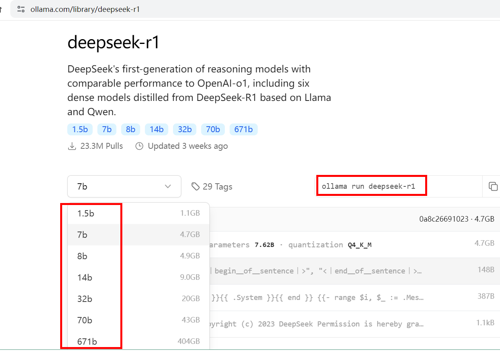

以 Windows 为例，根据不同版本，执行不同的命令拉取模型

比如，下载 1.5 b，执行下面命令：

```shell
ollama pull deepseek-r1:1.5b
```

### 1.4、启动 Ollama 服务测试

启动 Ollama 服务，默认会监听 http://localhost:11434

```shell
ollama run deepseek-r1:1.5b
```

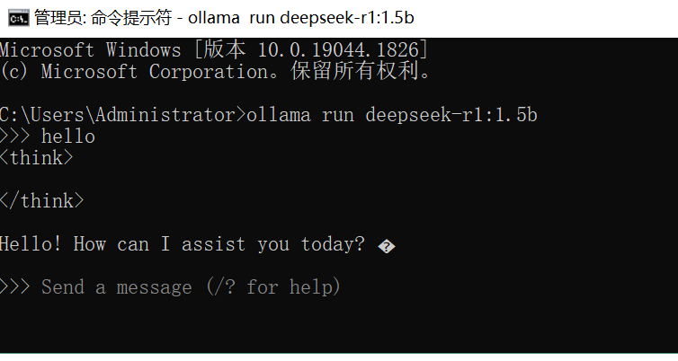

如果想退出对话，我们可以通过 `/bye ` 命令退出

若安装了多个模型，我们可以通过 `ollama list` 命令查看已安装了的模型

如果想运行某个模型，我们可以通过 `ollama run 模型名称` 命令运行即可

## 2、Spring AI 代码测试

1、创建 SpringBoot 工程

```xml
<?xml version="1.0" encoding="UTF-8"?>
<project xmlns="http://maven.apache.org/POM/4.0.0"
         xmlns:xsi="http://www.w3.org/2001/XMLSchema-instance"
         xsi:schemaLocation="http://maven.apache.org/POM/4.0.0 http://maven.apache.org/xsd/maven-4.0.0.xsd">
    <modelVersion>4.0.0</modelVersion>

    <parent>
        <groupId>org.springframework.boot</groupId>
        <artifactId>spring-boot-starter-parent</artifactId>
        <version>3.3.13</version>
        <relativePath/> <!-- lookup parent from repository -->
    </parent>

    <groupId>com.atguigu</groupId>
    <artifactId>springai_04_ollama</artifactId>
    <version>1.0-SNAPSHOT</version>

    <properties>
        <maven.compiler.source>17</maven.compiler.source>
        <maven.compiler.target>17</maven.compiler.target>
        <project.build.sourceEncoding>UTF-8</project.build.sourceEncoding>
        <spring-ai.version>1.1.2</spring-ai.version>
    </properties>

    <dependencyManagement>
        <dependencies>
            <dependency>
                <groupId>org.springframework.ai</groupId>
                <artifactId>spring-ai-bom</artifactId>
                <version>${spring-ai.version}</version>
                <type>pom</type>
                <scope>import</scope>
            </dependency>
        </dependencies>
    </dependencyManagement>

    <dependencies>
        <dependency>
            <groupId>org.springframework.boot</groupId>
            <artifactId>spring-boot-starter-web</artifactId>
        </dependency>

        <!--<dependency>
            <groupId>org.springframework.ai</groupId>
            <artifactId>spring-ai-ollama-spring-boot-starter</artifactId>
            <scope>compile</scope>
        </dependency>-->

        <dependency>
            <groupId>org.springframework.ai</groupId>
            <artifactId>spring-ai-starter-model-ollama</artifactId>
            <scope>compile</scope>
        </dependency>
    </dependencies>
</project>
```

2、创建配置文件 application.yml

```yaml
server:
  port: 8899

spring:
  application:
    name: spring-ai-ollama-demo
  ai:
    ollama:
      base-url: http://localhost:11434
      chat:
        options:
          model: deepseek-r1:1.5b
          temperature: 0.7
```

3、创建启动类

```java
@SpringBootApplication
public class SpringAiDemoApplication {
    public static void main(String[] args) {
        SpringApplication.run(SpringAiOllamaApplication.class, args);
    }
}
```

4、创建 Controller

```java
@RestController
public class OllamaController {
    @Autowired
    private OllamaChatModel ollamaChatModel;

    @GetMapping("/ai/test")
    public String generate(@RequestParam(value = "message", defaultValue = "hello") String message) {
        String response = ollamaChatModel.call(message);
        System.out.println("response: " + response);
        return response;
    }
}
```

5、测试

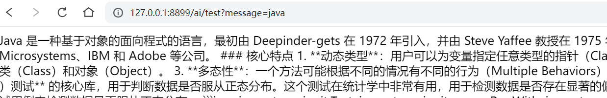

# 六、Spring AI Alibaba

## 1、概述

随着生成式 AI 的快速发展，基于 AI 开发框架构建 AI 应用的诉求迅速增长，涌现出了包括 LangChain、LlamaIndex 等开发框架，但大部分框架只提供了 Python 语言的实现。但这些开发框架对于国内习惯了 Spring 开发范式的 Java 开发者而言，并非十分友好和丝滑。

因此，阿里巴巴基于 Spring AI 发布并快速演进 Spring AI Alibaba，是阿里云通义系列模型及服务在 Java AI 应用开发领域的最佳实践，通过提供一种方便的 API 抽象，帮助 Java 开发者加速和简化 Java 智能体应用的开发。同时，提供了完整的开源配套，包括可观测、网关、消息队列、配置中心等。

Spring AI Alibaba 已完整提供 Model、Prompt、RAG、Tools 等 AI 应用开发所需的必备能力，将兼具提示词模板、函数调用、格式化输出等低层次抽象，以及 RAG、智能体、对话记忆等高层次抽象。

## 2、快速入门

1、申请阿里云 API Key

1）访问阿里云百炼页面并登录账号 <https://www.aliyun.com/product/bailian>

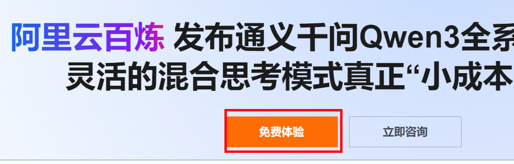

2）开通 “百炼大模型推理” 服务，获取 API Key。

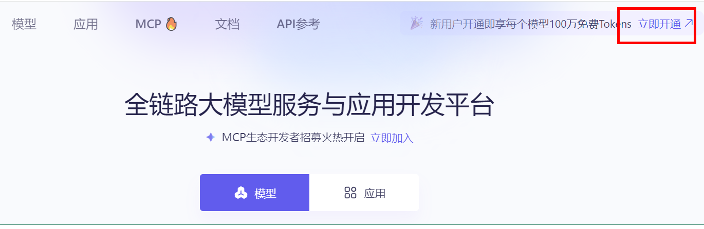


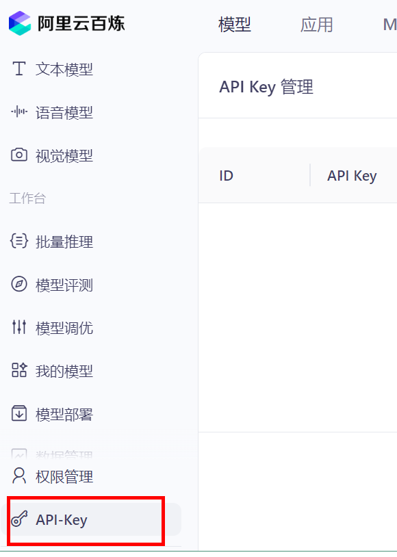


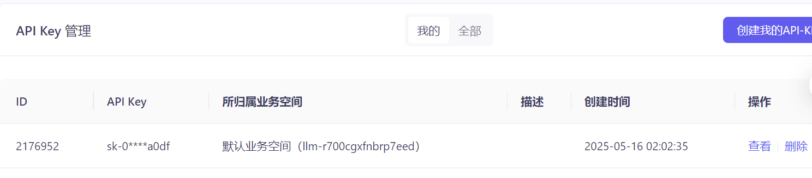

2、创建 SpringBoot 工程

官方文档：<https://java2ai.com/docs/quick-start>

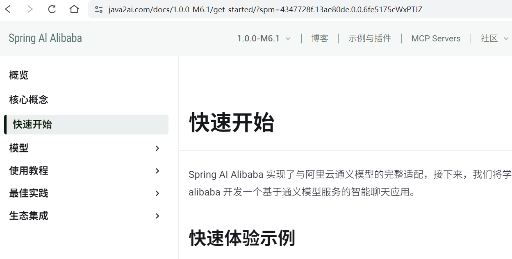

> Spring AI Alibaba 基于 Spring Boot 3.x 开发，因此本地 JDK 版本要求为 17 及以上

引入依赖：

```xml
<?xml version="1.0" encoding="UTF-8"?>
<project xmlns="http://maven.apache.org/POM/4.0.0"
         xmlns:xsi="http://www.w3.org/2001/XMLSchema-instance"
         xsi:schemaLocation="http://maven.apache.org/POM/4.0.0 http://maven.apache.org/xsd/maven-4.0.0.xsd">
    <modelVersion>4.0.0</modelVersion>

    <parent>
        <groupId>org.springframework.boot</groupId>
        <artifactId>spring-boot-starter-parent</artifactId>
        <version>3.4.13</version>
        <relativePath/> <!-- lookup parent from repository -->
    </parent>

    <groupId>com.atguigu</groupId>
    <artifactId>springai_05_alibaba</artifactId>
    <version>1.0-SNAPSHOT</version>

    <properties>
        <maven.compiler.source>17</maven.compiler.source>
        <maven.compiler.target>17</maven.compiler.target>
        <project.build.sourceEncoding>UTF-8</project.build.sourceEncoding>
    </properties>

    <dependencies>
        <dependency>
            <groupId>org.springframework.boot</groupId>
            <artifactId>spring-boot-starter-web</artifactId>
        </dependency>

        <!--<dependency>
            <groupId>com.alibaba.cloud.ai</groupId>
            <artifactId>spring-ai-alibaba-starter</artifactId>
            <version>1.0.0-M6.1</version>
        </dependency>-->

        <dependency>
            <groupId>com.alibaba.cloud.ai</groupId>
            <artifactId>spring-ai-alibaba-starter-dashscope</artifactId>
            <version>1.1.2.1</version>
            <scope>compile</scope>
        </dependency>
    </dependencies>
</project>
```

3、配置文件

```yaml
server:
  port: 8899

spring:
  application:
    name: spring-ai-alibaba-demo
  ai:
    dashscope:
      api-key: ${AI_DASHSCOPE_API_KEY} # 这里会读取环境变量
```

AI_DASHSCOPE_API_KEY 为配置的环境变量

4、编写 Controller

```java
@RestController
public class AlibabaController {
    private static final String DEFAULT_PROMPT = "你是一个博学的智能聊天助手，请根据用户提问回答！";

    private final ChatClient dashScopeChatClient;

    public AlibabaController(ChatClient.Builder chatClientBuilder) {
        this.dashScopeChatClient = chatClientBuilder
                .defaultSystem(DEFAULT_PROMPT)
                // 实现 Chat Memory 的 Advisor
                // 在使用 Chat Memory 时，需要指定对话 ID，以便 Spring AI 处理上下文。
                .defaultAdvisors(
                        MessageChatMemoryAdvisor.builder(MessageWindowChatMemory.builder().build()).build())
                // 实现 Logger 的 Advisor
                .defaultAdvisors(
                        new SimpleLoggerAdvisor())
                // 设置 ChatClient 中 ChatModel 的 Options 参数
                .defaultOptions(
                        DashScopeChatOptions.builder()
                                .withTopP(0.7)
                                .build()
                )
                .build();
    }
    
    /**
     * ChatClient 简单调用
     */
    @GetMapping("/simple/chat")
    public String simpleChat(@RequestParam(value = "query", defaultValue = "hello") String query) {
        return dashScopeChatClient.prompt(query).call().content();
    }

    /**
     * ChatClient 流式调用
     */
    @GetMapping("/stream/chat")
    public Flux<String> streamChat(@RequestParam(value = "query", defaultValue = "hello") String query, HttpServletResponse response) {
        response.setCharacterEncoding("UTF-8");
        return dashScopeChatClient.prompt(query).stream().content();
    }
}
```

# 七、Spring AI 的其他模型

## 1、图像模型

### 1.1、Image Model API 概述

在 Spring AI 框架中，Image Model API 旨在为与专注于图像生成的各种 AI 模型进行交互提供一个简单且可移植的接口，使开发者能够以最小的代码改动切换不同的图像相关模型。这一设计符合 Spring 模块化和互换性的理念，确保开发者可以快速调整其应用程序以适应不同的图像处理相关的 AI 能力。

此外，通过支持像 ImagePrompt 这样的辅助类来进行输入封装以及使用 ImageResponse 来处理输出，图像模型 API 统一了与致力于图像生成的 AI 模型之间的通信。它管理请求准备和响应解析的复杂性，为图像生成功能提供直接而简化的 API 交互。

Image Model API 建立在 Spring AI 通用模型 API 之上，提供了特定于图像的抽象和实现。

### 1.2、Image Model API 接口及相关类

1、ImageModel（图像模型）

这里展示的是 ImageModel 接口定义：

```java
@FunctionalInterface
public interface ImageModel extends Model<ImagePrompt, ImageResponse> {
	ImageResponse call(ImagePrompt request);
}
```

2、ImagePrompt（图像提示）

ImagePrompt 是一个封装了 ImageMessage 对象列表及可选模型请求选项的 ModelRequest。下面显示的是 ImagePrompt 类的一个简化版本，省略了构造函数和其他工具方法：

```java
public class ImagePrompt implements ModelRequest<List<ImageMessage>> {
    private final List<ImageMessage> messages;
    private ImageOptions imageModelOptions;
    
    @Override
    public List<ImageMessage> getInstructions() {...}
	
    @Override
	public ImageOptions getOptions() {...}
}
```

3、ImageMessage（图像消息）

ImageMessage 类封装了用于影响生成图像的文本及其权重。对于支持权重的模型，它们可以是正数或负数。

```java
public class ImageMessage {
	private String text; 
	private Float weight;
    public String getText() {...}
	public Float getWeight() {...}
}
```

4、ImageOptions（图像选项）

表示可以传递给图像生成模型的选项。ImageOptions 接口扩展了 ModelOptions 接口，并用于定义可以传递给 AI 模型的一些可移植选项。

```java
public interface ImageOptions extends ModelOptions {
	Integer getN();
	String getModel();
	Integer getWidth();
	Integer getHeight();
	String getResponseFormat(); // openai - url or base64: stability ai byte[] or base64
}
```

5、ImageResponse（图像响应）

持有 AI 模型的输出，每个 ImageGeneration 实例包含来自单一提示的可能多个输出结果之一。

```java
public class ImageResponse implements ModelResponse<ImageGeneration> {
	private final ImageResponseMetadata imageResponseMetadata;
	private final List<ImageGeneration> imageGenerations;
	
    @Override
	public ImageGeneration getResult() {
		// get the first result
	}
    
	@Override
	public List<ImageGeneration> getResults() {...}
	
    @Override
	public ImageResponseMetadata getMetadata() {...}
}
```

6、ImageGeneration（图像生成）

最终，ImageGeneration 类扩展自 ModelResult，代表输出响应及有关此结果的元数据。

```java
public class ImageGeneration implements ModelResult<Image> {
	private ImageGenerationMetadata imageGenerationMetadata;
	private Image image;
    
    @Override
	public Image getOutput() {...}
	
    @Override
	public ImageGenerationMetadata getMetadata() {...}
}
```

### 1.3、Spring AI 实现生成图像

Spring AI 框架的 ImageModel API 抽象了应用程序通过模型调用实现 “文生图” 的交互过程，基本流程：应用程序接收文本，调用模型生成图片。ImageModel 的入参为包装类型 ImagePrompt，输出类型为 ImageResponse。

本示例使用 Spring AI Alibaba 开源框架，spring-ai-alibaba-starter-dashscope AutoConfiguration 默认初始化了 ImageModel 实例，我们可以选择直接注入并使用默认实例。

```java
@RestController
public class ImageModelController {
    @Autowired
    private DashScopeImageModel dashScopeImageModel;

    @GetMapping("/image")
    public void getImage(@RequestParam(value = "message", defaultValue = "生成一只小猫") String message, HttpServletResponse response) {
        /*ImageResponse imageResponse = dashScopeImageModel.call(
                new ImagePrompt(
                        message,
                        DashScopeImageOptions.builder()
                                .model(DashScopeImageApi.DEFAULT_IMAGE_MODEL)
                                .n(1) // 要生成的图像数。必须介于 1 和 10 之间。
                                .height(1024) // 生成的图像的高宽度
                                .width(1024).build()
                )
        );*/
        ImageResponse imageResponse = dashScopeImageModel.call(new ImagePrompt(message));
        // 获取生成图像的地址
        String imageUrl = imageResponse.getResult().getOutput().getUrl();
        try {
            // 使用输出流在浏览器输出
            URL url = URI.create(imageUrl).toURL();
            InputStream in = url.openStream();
            response.setHeader("Content-Type", MediaType.IMAGE_PNG_VALUE);
            response.getOutputStream().write(in.readAllBytes());
            response.getOutputStream().flush();
        } catch (Exception e) {
            response.setStatus(HttpServletResponse.SC_INTERNAL_SERVER_ERROR);
        }
    }
}
```

## 2、语音模型

### 2.1、Text-to-Speech API 概述

在 Spring AI 框架中，Text-to-Speech API 提供了一个基于 OpenAI 的 TTS（文本转语音）模型的语音端点，使用户能够：

* 朗读写好的博客文章

* 生成多种语言的语音音频

* 使用流媒体实现实时音频输出

这一功能强大的 API 让用户可以轻松地将文字内容转化为语音内容，不仅支持多语言转换，还能满足实时语音输出的需求，极大地提升了内容的可访问性和用户的体验感。

### 2.2、Spring AI 实现文本转语音

本示例基于 Spring AI Alibaba 开源框架

DashScopeAudioSpeechModel 类是 Spring AI Alibaba 框架中用于表示和管理文本转语音模型的核心组件之一。

DashScopeAudioSpeechOptions 类通常用于配置文本转语音（TTS）服务的选项，这个类允许开发者指定一系列参数（比如：语速、音调、音量等）来定制化语音合成的结果，从而满足不同的应用场景需求。

```java
@RestController
public class AudioModelController {
    @Autowired
    private DashScopeAudioSpeechModel dashScopeAudioSpeechModel;

    private static final String TEXT = "床前明月光，疑是地上霜。举头望明月，低头思故乡。";

    private static final String PATH = System.getProperty("user.dir") + 
        "\\springai_06_image_audio\\src\\main\\resources\\audio";

    @GetMapping("/tts")
    public void tts() {
        // 使用构建器模式创建DashScopeAudioSpeechOptions实例并设置参数
        DashScopeAudioSpeechOptions options =
                DashScopeAudioSpeechOptions.builder()
                        .speed(1.0) // 语速：1.0为正常速度
                        .pitch(0.9) // 音调：0.9略低于正常音调
                        .volume(60) // 音量：60
                        .build();

        TextToSpeechResponse response = dashScopeAudioSpeechModel.call(new TextToSpeechPrompt(TEXT, options));
        
        File file = new File(PATH + "\\output.mp3");
        try (FileOutputStream fos = new FileOutputStream(file)) {
            byte[] output = response.getResult().getOutput();
            fos.write(output);
        } catch (IOException e) {
            e.printStackTrace();
        }
    }
}
```

# 八、Spring AI 实现 RAG

## 1、概述

### 1.1、向量化

向量数据库（Vector Database）是一种以数学向量的形式存储数据集合的数据库，通过一个数字列表来表示维度空间中的一个位置。在这里，向量数据库的功能是可以基于相似性搜索进行识别，而不是精准匹配。比如说在使用一个商城系统的向量数据库进行查询的时候，用户输入 “北京”，其可能返回的结果会是 “中国、北京、华北、首都、奥运会” 等信息；输入“沈阳”，其返回结果可能会是 “东北、辽宁、雪花、重工业” 等信息。当然，返回的信息取决于向量数据库中存在的数据。用户可以通过参数的设置来限定返回的情况，进而适配不同的需求。

嵌入模型（Embedding Model）和向量数据库（Vector Database / Vector Store）是一对亲密无间的合作伙伴，也是 AI 技术栈中紧密关联的两大核心组件，两者的协同作用构成了现代语义搜索、推荐系统和 RAG（Retrieval Augmented Generation，检索增强生成）等应用的技术基础。

### 1.2、RAG

1、RAG 的基本概念

**RAG**，全称 **Retrieval Augmented Generation**，中文叫做**检索增强生成**。RAG 是一种结合了检索系统和生成模型的新型技术框架，其主要目的有：

- 利用外部知识库
- 帮助大模型生成**更加准确、有依据、最新的回答**

通过使用 RAG，解决了传统 LLM 存在的两个主要问题：

- 知识局限性：LLM 的知识被固定在训练数据中，无法知道最新消息。
- 幻觉现象：LLM 有时候会编造出并不存在的答案

通过检索外部知识，RAG 让模型突破了知识局限性，也让 LLM（大语言模型）的幻觉现象得到解决。

2、RAG 的使用场景

RAG 技术可以用于多种应用场景，根据不同的知识库与提示词，适配不同的需求。下面是一些常见的典型使用场景：

- 企业内部知识问答
  - 需求：员工需要查询公司规章制度、流程文档、技术手册。
  - RAG 方案：
    - 把企业文档库作为检索源
    - 用户提问时，检索相关文档段落，再由模型总结回答
- 金融 / 法律领域应用
  - 需求：解答合规、财税、法律问题，要求答案严谨。
  - RAG 方案：
    - 检索法条、案例、内部政策文档
    - 基于检索到的条款生成规范回答
- 电商 / 客服智能助理
  - 需求：自动回答用户关于商品、物流、售后等问题
  - RAG 方案
    - 检索商品知识库、FAQ 文档
    - 给出准确、即时的答复
- 医疗健康领域
  - 需求：为患者或医生提供疾病知识、药物信息、医院信息、诊疗方案
  - RAG 方案
    - 检索医疗文献、医院文档、指南资料
    - 给出专业、可靠的医学服务

3、RAG 工作流程概述

**第一，用户输入问题**

用户在输入窗口输入自己的问题，这一数据被接收，并作为后续处理的查询入口

例如：用户提问：“我的智能手表出现蓝牙连接问题，怎么办？”

**第二，问题向量化**

根据用户初始输入的问题，调用 Embedding 模型，将问题转换为高维向量，以便于后续的相似度检索。

```
文本："我的智能手表出现蓝牙连接问题，怎么办？"
→ 向量：[0.123, 0.582, ..., 0.001]
```

**第三，向量数据库检索**

系统会连接到一个向量数据库（如 FAISS、Milvus、Pinecone、Weaviate）。然后用刚才生成的问题向量，检索知识库中与之最相似的文档片段。

当检索的时候，常见的检索参数包括：

- Tok-K：检索最相关的 K 条记录
- 相似度阈值：控制检索到内容的相关性

最后输出的结果往往是 K 条知识片段

```
1. "蓝牙连接问题通常可以通过重启设备和重新配对解决。"
2. "如果手表固件版本较旧，请更新到最新版本以兼容蓝牙。"
3. "某些环境下，如电磁干扰，也会导致连接失败。"
```

**第四，构建上下文**

这一阶段需要组织提示词（Prompt），让 LLM 更好地理解背景信息。

这一部分包括：

- 系统提示词（System Prompt）
  - 提前告诉 LLM 需要遵循的行为规范，比如：你是一个专业的智能手表客服助理。请基于提供的背景资料，准确回答用户的问题。如果资料中没有明确答案，请如实告诉用户而不是编造。
  - 系统提示词可以有效地设定模型角色、控制回答风格、防止幻觉

- 构造最终输入（Final Prompt）
  - 一般会结合以上内容，按照如下格式进行组织：

```
【背景资料】
1. 蓝牙连接问题通常可以通过重启设备和重新配对解决。
2. 如果手表固件版本较旧，请更新到最新版本以兼容蓝牙。
3. 某些环境下，如电磁干扰，也会导致连接失败。

【用户问题】
我的智能手表出现蓝牙连接问题，怎么办？

【回答要求】
请结合以上资料，用简洁明了的方式回答用户的问题。如果答案无法直接从资料中找到，请礼貌告知用户。
```

**第五，调用 LLM**

将构造好的 Prompt 提交给 LLM（比如 Deepseek、Qwen、GPT-4o、Claude 等）

- 模型读取检索到的内容和问题
- 组织自然、连贯、准确的回答

生成结果示例：

"您好！根据我们的资料，您可以尝试重启智能手表并重新进行蓝牙配对。如果问题仍未解决，请检查手表固件是否为最新版本。如处于高电磁干扰环境，也可能影响连接质量，建议更换使用环境。"

**第六，返回最终回答给用户**

最终系统将生成的回答返回前端，展示给用户。

> **总结**：
>
> 在 RAG 工作时，其运行流程大致为：
>
> 1. 用户输入问题
> 2. 问题向量化
> 3. 向量数据库检索
> 4. 构建上下文（含系统提示词）
> 5. 携带检索内容，调用大模型进行回答
> 6. 返回最终答案给用户

## 2、Spring AI 实现基本 RAG 流程

1、引入相关依赖

```xml
<?xml version="1.0" encoding="UTF-8"?>
<project xmlns="http://maven.apache.org/POM/4.0.0"
         xmlns:xsi="http://www.w3.org/2001/XMLSchema-instance"
         xsi:schemaLocation="http://maven.apache.org/POM/4.0.0 http://maven.apache.org/xsd/maven-4.0.0.xsd">
    <modelVersion>4.0.0</modelVersion>

    <parent>
        <groupId>org.springframework.boot</groupId>
        <artifactId>spring-boot-starter-parent</artifactId>
        <version>3.4.13</version>
        <relativePath/> <!-- lookup parent from repository -->
    </parent>

    <groupId>com.atguigu</groupId>
    <artifactId>springai_07_rag</artifactId>
    <version>1.0-SNAPSHOT</version>

    <properties>
        <maven.compiler.source>17</maven.compiler.source>
        <maven.compiler.target>17</maven.compiler.target>
        <project.build.sourceEncoding>UTF-8</project.build.sourceEncoding>
    </properties>

    <dependencies>
        <dependency>
            <groupId>org.springframework.boot</groupId>
            <artifactId>spring-boot-starter-web</artifactId>
        </dependency>

        <dependency>
            <groupId>com.alibaba.cloud.ai</groupId>
            <artifactId>spring-ai-alibaba-starter-dashscope</artifactId>
            <version>1.1.2.1</version>
            <scope>compile</scope>
        </dependency>

        <dependency>
            <groupId>org.springframework.ai</groupId>
            <artifactId>spring-ai-advisors-vector-store</artifactId>
            <version>1.1.2</version>
            <scope>compile</scope>
        </dependency>
    </dependencies>
</project>
```

2、编写配置文件

```yaml
server:
  port: 8899

spring:
  application:
    name: spring-ai-rag-demo
  ai:
    dashscope:
      api-key: ${AI_DASHSCOPE_API_KEY}
```

3、创建配置类

```java
@Configuration
public class RagConfig {
    @Bean
    ChatClient chatClient(ChatClient.Builder builder) {
        return builder
            .defaultSystem("你将作为一名Java开发语言的专家，对于用户的使用需求作出解答")
            .build();
    }

    @Bean
    VectorStore vectorStore(EmbeddingModel embeddingModel) {
        SimpleVectorStore simpleVectorStore = SimpleVectorStore
            .builder(embeddingModel).build();

        // 生成说明文档
        List<Document> documents = List.of(
                new Document("产品说明:名称：Java开发语言\n" +
                        "产品描述：Java是一种面向对象开发语言。\n" +
                        "特性：\n" +
                        "1. 封装\n" +
                        "2. 继承\n" +
                        "3. 多态\n"));
        
        // 向量化存储
        simpleVectorStore.add(documents);
        return simpleVectorStore;
    }
}
```

通过这个配置类，完成以下内容：

* 配置 ChatClient 作为 Bean，其中设置系统默认角色为 Java 开发语言专家，负责处理用户查询并生成回答向量存储配置。

* 初始化 SimpleVectorStore，加载 Java 开发语言说明文档，将文档转换为向量形式存储。

4、编写 Controller

```java
@RestController
public class RagController {
    @Autowired
    private ChatClient chatClient;

    @Autowired
    private VectorStore vectorStore;

    @GetMapping("/rag")
    public String rag(String input) {
        String content = chatClient.prompt().user(input)
                .advisors(QuestionAnswerAdvisor.builder(vectorStore).build())
                .call().content();
        return content;
    }
}
```

通过添加 QuestionAnswerAdvisor 并提供对应的向量存储，可以将之前放入的文档作为参考资料，并生成增强回答。

5、测试

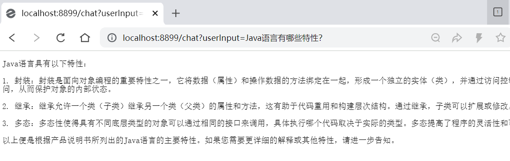

# 九、Spring AI 综合案例

需求：智能简历筛选助手

该助手借助 Spring AI 的特性结合人工智能技术，为企业提供快速查看应聘候选人的信息及与候选人岗位的匹配度的服务。

1、搭建环境

1）创建工程，引入依赖

```xml
<?xml version="1.0" encoding="UTF-8"?>
<project xmlns="http://maven.apache.org/POM/4.0.0"
         xmlns:xsi="http://www.w3.org/2001/XMLSchema-instance"
         xsi:schemaLocation="http://maven.apache.org/POM/4.0.0 http://maven.apache.org/xsd/maven-4.0.0.xsd">
    <modelVersion>4.0.0</modelVersion>

    <parent>
        <groupId>org.springframework.boot</groupId>
        <artifactId>spring-boot-starter-parent</artifactId>
        <version>3.4.13</version>
        <relativePath/> <!-- lookup parent from repository -->
    </parent>

    <groupId>com.atguigu</groupId>
    <artifactId>springai_08_case</artifactId>
    <version>1.0-SNAPSHOT</version>

    <properties>
        <maven.compiler.source>17</maven.compiler.source>
        <maven.compiler.target>17</maven.compiler.target>
        <project.build.sourceEncoding>UTF-8</project.build.sourceEncoding>
    </properties>

    <dependencies>
        <dependency>
            <groupId>org.springframework.boot</groupId>
            <artifactId>spring-boot-starter-web</artifactId>
        </dependency>

        <dependency>
            <groupId>com.alibaba.cloud.ai</groupId>
            <artifactId>spring-ai-alibaba-starter-dashscope</artifactId>
            <version>1.1.2.1</version>
            <scope>compile</scope>
        </dependency>
    </dependencies>
</project>
```

2）创建配置文件

```yaml
server:
  port: 8899

spring:
  application:
    name: spring-ai-case
  ai:
    dashscope:
      api-key: ${AI_DASHSCOPE_API_KEY}
```

2、创建 RAG 知识库

用全部候选人的简历构建一个简历知识库

1）创建 txt 文本

命名 “张三简历.txt”，放到 resource 目录下

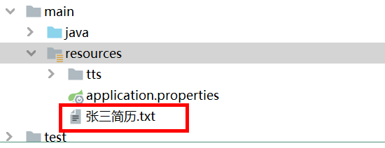

```txt
教育经历
北京大学 软件工程 本科 2005.09 - 2009.06
主修课程：Java语言开发、C语言开发、操作系统、编译原理、计算机网络、算法导论、电商商务、电子基础、高等数学、概率论与统计、离散数学
工作经验
阿里巴巴有限公司 算法工程师
2009-7-1 - 2015-7-10
拥有五年以上的算法工程师经验，熟悉各种开发语言的使用，比如Java、C++、C#等，熟练使用各种主流深度学习框架，
能独立开发出高质量、高性能的算法模型，精通数据结构、算法及机器学习模型的实现与优化，在多个项目中负责算法模型的设计与开发，
包括基于深度学习的图像识别、语音识别及自然语言处理等方向。
小米科技有限公司 算法工程师
2015-8-1 - 2020-3-1
担任小米科技有限公司算法工程师，负责参与开发高性能机器学习算法。
在项目中，我使用Python和MATLAB编写了多种算法模型，并且实现了GPU加速计算，使得算法在处理大规模复杂数据时表现优异。
就职于小米科技有限公司，作为算法工程师，全程参与了一款自动驾驶系统的开发。
在项目中，我主要通过深度学习、目标检测等技术，实现了车辆识别、道路分割等多项技术难点，使得系统在真实道路环境下表现出了较高的稳定性和可靠性。
在小米科技有限公司，我作为算法工程师负责了一项推荐系统的研发。
该系统基于用户行为数据，使用协同过滤和深度学习技术，为用户推荐最优质的内容。在项目中，我优化了多种推荐算法，优化推荐精度达到了90%以上。
```

2）配置类 RagConfig 中添加 Bean

```java
@Bean
VectorStore vectorStore(EmbeddingModel embeddingModel) {
    SimpleVectorStore simpleVectorStore = SimpleVectorStore.builder(embeddingModel).build();
    // 提取文本内容
    String filePath="张三简历.txt";
    TextReader textReader = new TextReader(filePath);
    textReader.getCustomMetadata().put("filePath",filePath);
    List<Document> documents = textReader.get();
    // 文本切分段落
    TokenTextSplitter splitter = new TokenTextSplitter(1200, 350, 5, 100, true);
    splitter.apply(documents);
	// 向量化存储
    simpleVectorStore.add(documents);
    return simpleVectorStore;
}
```

通过以上过程，一个简单的 RAG 知识库就创建完成了，使用时直接在向量库中检索即可

3、创建工具类

1）创建工具

创建一个工具（Function），可以用来查询候选人应聘的岗位。

```java
public class RecruitServiceFunction implements Function<RecruitServiceFunction.Request, RecruitServiceFunction.Response> {
    @Override
    public Response apply(Request request) {
        String position = "未知";
        if (request.name.contains("张三")) {
            position = "算法工程师";
        }
        return new Response(position);
    }

    public record Request(String name) {}
    public record Response(String position) {}
}
```

2）配置类 RagConfig 中添加 Bean

```java
@Bean
@Description("某某是否有资格面试")
public Function<RecruitServiceFunction.Request, RecruitServiceFunction.Response> recruitServiceFunction() {
    return new RecruitServiceFunction();
}
```

4、编写应用的人设

角色与目标：你是一个招聘助手，会针对用户的问题，结合候选人经历，岗位匹配度等专业知识，给用户提供指导。
指导原则：你需要确保给出的建议合理科学，不会对候选人的表现有言论侮辱。
限制：在提供建议时，需要强调在个性建议方面用户仍然需要线下寻求专业咨询。
澄清：在与用户交互过程中，你需要明确回答用户关于招聘方面的问题，对于非招聘方面的问题，你的回应是‘我只是一个招聘助手，不能回答这个问题哦’。
个性化：在回答时，你需要以专业可靠的预期回答，偶尔可以带点幽默感。调节气氛。

5、编写 Controller

将人设、知识库、工具通过 Spring AI 框架串联起来，搭建成应用

```java
@RestController
public class CaseController {
    @Autowired
    private ChatModel chatModel;

    @Autowired
    private VectorStore vectorStore;

    @GetMapping("/ai/agent")
    public String agent(@RequestParam("query") String query) {
        // 检索
        List<Document> documents = vectorStore.similaritySearch(query);
        // 提取信息
        String info = "";
        if (documents.size() > 0) {
            info = documents.get(0).getFormattedContent();
        }
        // 构造系统prompt
        String systemPrompt= """
            角色与目标：你是一个招聘助手，会针对用户的问题，结合候选人经历，岗位匹配度等专业知识，给用户提供指导。
            指导原则：你需要确保给出的建议合理科学，不会对候选人的表现有言论侮辱。
            限制：在提供建议时，需要强调在个性建议方面用户仍然需要线下寻求专业咨询。
            澄清：在与用户交互过程中，你需要明确回答用户关于招聘方面的问题，对于非招聘方面的问题，你的回应是‘我只是一个招聘助手，不能回答这个问题哦’。
            个性化：在回答时，你需要以专业可靠的预期回答，偶尔可以带点幽默感。调节气氛。
            给你提供一个数据参考，并且给你调用岗位投递检索公户
            请你跟进数据参考与工具返回结果回复用户的请求。
            """;
        // 构造用户prompt
        String userPrompt= """
            给你提供一些数据参考：{info},请回答我的问题：{query}。
            请你跟进数据参考与工具返回结果回复用户的请求。
            """;
        // 构造提示词
        SystemMessage systemMessage = new SystemMessage(systemPrompt);
        PromptTemplate promptTemplate = new PromptTemplate(userPrompt);
        Message userMessage = promptTemplate.createMessage(Map.of("info", info, "query", query));
        Prompt prompt = new Prompt(List.of(userMessage, systemMessage),
                DashScopeChatOptions.builder().toolNames(Set.of("recruitServiceFunction")).build());
        // 调用
        List<Generation> results = chatModel.call(prompt).getResults();
        String content = results.stream().map(x -> x.getOutput().getText()).collect(Collectors.joining());
        return content;
    }
}
```

6、测试

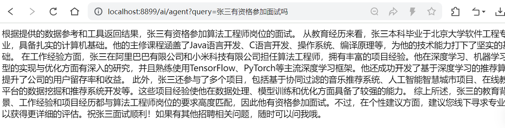

> 课程总结：
>
> 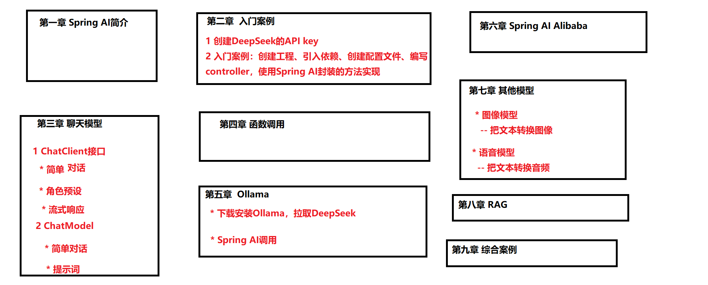

